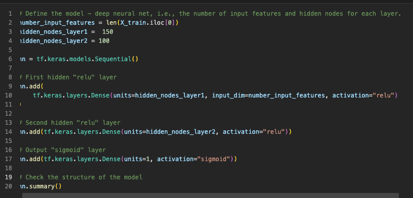

# Neural Network Model

**Overview**
The purpose of this analysis was to utilize my newfound knowledge of machine learning and neural networks. Specifically to predict whether applicants to the Alphabet Soup nonprofit foundation would be succesful if funded by Alphabet Soup. 

The csv provided contains 34,000 organizations that have received funding from Alphabet Soup over the years. This data will be used to predict the success rate of an organization that has received funding. 

**Results**

-Data Preprocessing-
* The target variables were application_type, affiliation, and classification primarily. 

* The feature variable was the "IS_SUCCESSFUL" column, denoting the success of an organization after funding. 1- being yes. 0-being no. 

* The variables to be removed were 'EIN' and 'NAME'

-Compiling, Training, and Evaluating the Model-
* 2 hidden layers were chosen
* hidden layer 1 contains 150 nodes
* hidden layer 2 contains 100 nodes
* these numbers seemed to be sufficient in calculating the model without going overboard with additional layers and nodes

* 2 activation functions were used: 
* relu was used for hidden layers 1 and 2
* sigmoid was used for the output layer
* relu was used as it is robust and will yield good results, sigmoid was my attempt at caatching in extraneus data points that may have slipped through the relu activation functions

* The first step I took to increase model performance was to run the layers with substantially lower nodes (i.e. 8 and 5, respectively). Seeing the accuracy was not sufficient I quickly worked my way up to 150 and 100 to get results that mirrored the example data. 

**Summary**

* Given that the accuracy was only 72%, it's hard to recommend this particular model as a strong indicator of success for organizations receiving funding from the Alphabet Soup organization. 

* Adding several more layers and nodes may help increae accuracy of models conducted in the future. More layers and nodes will better identify trends amidst the dataset. 

* Incorporating additional activation units may be beneficial as well, e.g. tanh. Although, looking over some of my peers models who used this did not yield results that were substantially better. Would definitelly recommend more nodes and layers though. 
